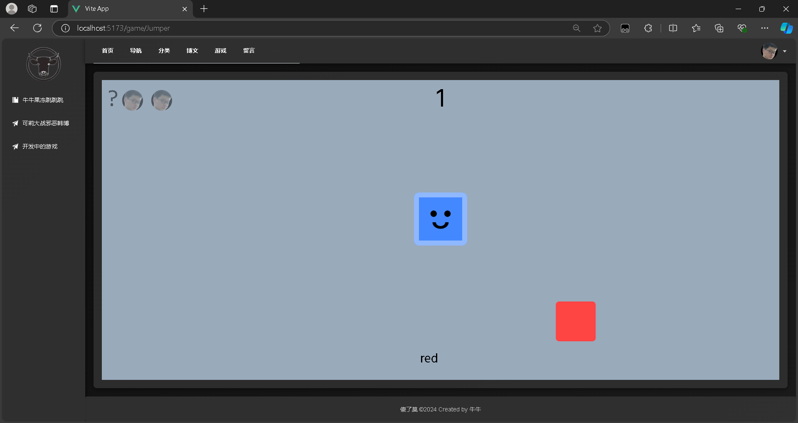

# 一个简单的个人博客管理平台

## 前端技术栈

- vue3
- js
- html
- css
- element-plus

## 后端技术栈

- springboot
- redis
- mysql
- mybatis

## About界面

### 屏控1


### 屏控2


## 首页展示


### 页面介绍

1. 左边为文章界面点击文字名字就能进行阅读

2. 右边为热门博客功能能够实时统计前五名博客热度并且将前三名展示在卡片中(卡片上的时间为该文章的创建时间)


### 功能介绍

- 允许检索内容和模糊搜素以及统计热度


## 阅读器展示


分为目录和内容两部分

### 目录

- 目录可以用来检索到文章的指定位置


### 内容

- 内容由解析md文件得到同时右上角展示作者头像以及阅读量


## 导航页面


- 用于快速到指定位置同时允许用google引擎进行搜索问题
- 其他card可以快速定位到指定路由


## 留言页面


- 有星星闪烁，弹幕发送等功能


## 管理端页面展示

### 文章分类


- 支持增删改查


### 文章管理


- 支持搜索功能


### 个人中心

#### 基本资料


#### 更换头像


#### 重置密码


### 编辑器


#### 发布表单


- 有小型阅读器


## html小游戏

按F5刷新游戏资源启动

### 游戏1



- 空格变色颜色一样得分

### 游戏2


- b键发射，血为0结束游戏


# 环境

## 后端环境

**.yaml文件**

```yaml
spring:
  datasource:
    driver-class-name: com.mysql.cj.jdbc.Driver
    url: jdbc:mysql:// localhost:3306/myhome
    username: root
    password: 123456

  data:
    redis:
      host: localhost
      port: 6379
server:
  port: 8080

mybatis:
  configuration:
    map-underscore-to-camel-case: true

logging:
  level:
    sql: debug
#    root: debug


```

## 前端环境

```sh
npm install
```

# 友情链接

------

[弹幕组件]: https://github.com/hellodigua/vue-danmaku

